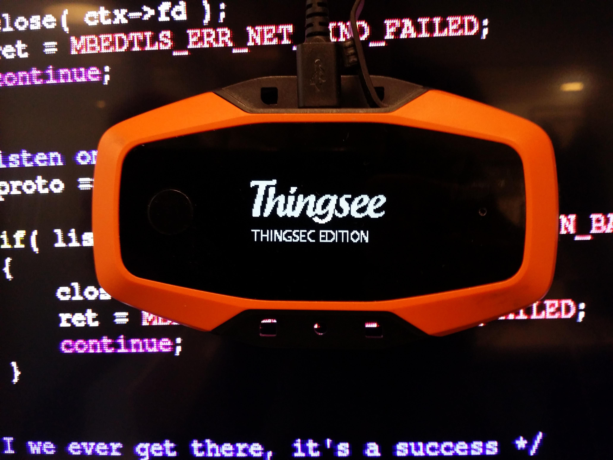

# University capstone project
Security research on [Thingsee One](https://thingsee.com/data-sheet), an IoT device

Background material

 - [Security in the Internet of Things through obfuscation and diversification](http://ieeexplore.ieee.org/xpl/articleDetails.jsp?arnumber=7374189) 

### Folders

* [Configs](/configs)
	- Various configuration files for the [SDK](https://github.com/thingsee/thingsee-sdk)
* [Demo](/demo)
    - Demonstration program for http(s) callbacks from thingsee to 
* [Misc](/misc)
	- Hello world memory reading test
	- romfsimg that does not start ts_engine
* [ResetDFU](/resetdfu)
	- nsh application for booting the device into Device Firmware Upgrade mode
* [Branding](/branding)
	 - Replace bootlogo with ThingSec edition
 
 
### Branches

- [thingsee-nuttx-mbedtls](https://github.com/Python1320/capstone_project/tree/thingsee-nuttx-mbedtls)
	- Contains [mbed TLS](https://www.mbed.com/en/development/software/mbed-tls/) integration into NuttX/Thingsee SDK
	- Hello wold nsh program for testing mbed TLS
- master
	- This branch
- [protected-test](https://github.com/Python1320/capstone_project/tree/protected-test)
	- [NuttX protected build](http://nuttx.org/doku.php?id=wiki:howtos:kernelbuild) attempt on Thingsee SDK
- [qemu_protected_nsh](https://github.com/Python1320/capstone_project/tree/qemu_protected_nsh)
	- An attempt to build NuttX alone on [QEmu](http://qemu.org) for protected build testing
- [thingsee-nuttx-mbedtls-conn_comm_integration](https://github.com/Python1320/capstone_project/tree/thingsee-nuttx-mbedtls-conn_comm_integration)
	- SSL integration for Thingsee device's custom http callbacks

Feel free to ask on GitHub issues any related questions.
